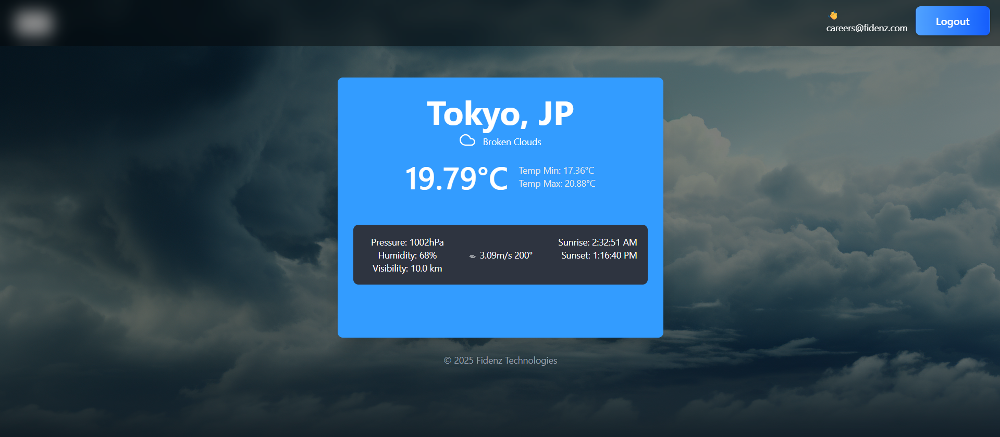

# 🌦️ Weather App - Full Stack Assignment

A secure weather application that displays **real-time weather information** for multiple cities with **Auth0 authentication and authorization**.

---

## 🌟 Features

- **Weather Display**: View weather information for multiple cities  
- **Detailed Weather View**: Click on any city card to see comprehensive weather details  
- **Authentication**: Secure login/logout using Auth0  
- **Multi-Factor Authentication (MFA)**: Email-based MFA for enhanced security  
- **Data Caching**: 5-minute cache to optimize API requests  
- **Responsive Design**: Works seamlessly on desktop and mobile devices  
- **Modern UI**: Beautiful gradient designs with smooth animations  

---

## 🛠️ Tech Stack

### **Frontend**
- React 18 with TypeScript  
- React Router for navigation  
- Auth0 React SDK for authentication  
- Axios for API requests  
- Tailwind CSS for styling  
- React Icons for weather icons  
- Vite as build tool  

### **Backend**
- Node.js with Express  
- Auth0 for authentication & authorization  
- OpenWeatherMap API for weather data  
- node-cache for data caching  
- express-jwt & jwks-rsa for JWT validation  

---

## 📋 Prerequisites

- Node.js (v16 or higher)  
- npm or yarn  
- Auth0 account  
- OpenWeatherMap API key  

---

## 🚀 Setup Instructions

### 1️⃣ Clone the Repository

```bash
git clone https://github.com/Ekdvs/weather-app.git
cd weather-app
```

### 2️⃣ Backend Setup

```bash
cd backend
npm install
```

Create a `.env` file in the backend directory:

```env
PORT=8080
OPENWEATHER_API_KEY=your_openweathermap_api_key
AUTH0_DOMAIN=your_auth0_domain
AUTH0_AUDIENCE=https://fidenz-weather-app/api
AUTH0_ISSUER_BASE_URL=https://your_auth0_domain
AUTH0_JWKS_URI=https://your_auth0_domain/.well-known/jwks.json
```

### 3️⃣ Frontend Setup

```bash
cd frontend
npm install
```

Create a `.env` file in the frontend directory:

```env
VITE_AUTH0_DOMAIN=your_auth0_domain
VITE_AUTH0_CLIENT_ID=your_auth0_client_id
VITE_AUTH0_AUDIENCE=https://fidenz-weather-app/api
```

### 4️⃣ Auth0 Configuration

#### Create Auth0 Application

1. Go to [Auth0 Dashboard](https://manage.auth0.com/)
2. Create a new **Single Page Application**
3. Note down the **Domain** and **Client ID**

#### Configure Application Settings

```
Allowed Callback URLs: http://localhost:5173
Allowed Logout URLs: http://localhost:5173
Allowed Web Origins: http://localhost:5173
```

#### Create API

1. Go to **Applications → APIs**
2. Create a new API with identifier: `https://fidenz-weather-app/api`
3. Use this identifier as your `AUTH0_AUDIENCE`

#### Enable Multi-Factor Authentication (MFA)

1. Go to **Security → Multi-factor Auth**
2. Enable **Email** as MFA factor
3. Set MFA as required for all users

#### Create Test User

1. Go to **User Management → Users**
2. Create a new user:
   ```
   Email: careers@fidenz.com
   Password: Pass#fidenz
   ```
3. Disable public signups in **Authentication → Database → Your Database → Settings**

### 5️⃣ OpenWeatherMap API Key

1. Sign up at [OpenWeatherMap](https://openweathermap.org/api)
2. Navigate to **API Keys** section
3. Copy your API key and add it to your backend `.env` file

---

## 🏃 Running the Application

### Start Backend Server

```bash
cd backend
npm start
```

➡️ The backend will run on `http://localhost:8080`

### Start Frontend Development Server

```bash
cd frontend
npm run dev
```

➡️ The frontend will run on `http://localhost:5173`

---

## 📁 Project Structure

```
weather-app/
├── backend/
│   ├── controller/
│   │   └── weatherController.js
│   ├── middleware/
│   │   └── auth.js
│   ├── router/
│   │   └── weatherRouter.js
│   ├── service/
│   │   └── weatherService.js
│   ├── cities.json
│   ├── index.js
│   ├── package.json
│   └── .env
├── frontend/
│   ├── src/
│   │   ├── components/
│   │   │   ├── Navbar.tsx
│   │   │   ├── WeatherCard.tsx
│   │   │   └── WeatherDetail.tsx
│   │   ├── pages/
│   │   │   ├── Dashboard.tsx
│   │   │   └── ViewWeather.tsx
│   │   ├── services/
│   │   │   └── weatherService.ts
│   │   ├── App.tsx
│   │   ├── App.css
│   │   ├── index.css
│   │   └── main.tsx
│   ├── package.json
│   └── .env
└── README.md
```

---

## 🔐 Authentication Flow

1. User visits the application
2. If not authenticated → redirected to Auth0 login
3. User logs in with `careers@fidenz.com` / `Pass#fidenz`
4. MFA verification via email (if enabled)
5. Upon success → user can view weather data
6. JWT token is used for secure API authorization

---

## 🌤️ API Endpoints

### Backend Endpoints

| Method | Endpoint | Description |
|--------|----------|-------------|
| GET | `/api/weather` | Fetch weather for all cities |
| POST | `/api/weather/:id` | Fetch weather for a specific city |

---

## 💾 Caching Strategy

- Weather data cached for **5 minutes**
- Reduces redundant API calls to OpenWeatherMap
- Improves application performance
- Cached data served for repeated requests within timeframe

---

## 🎨 UI Features

### Dashboard
- Grid layout showing all cities
- Each card includes:
  - City name and country
  - Current temperature
  - Weather description with icon
  - Min/Max temperature
  - Pressure, humidity, visibility, wind speed
  - Sunrise/sunset times

### Detail View
- Enlarged weather information for selected city
- Back navigation to dashboard
- Same comprehensive data as cards
- Clean, centered layout

---

## 📱 Responsive Design

- **Desktop**: 2-column grid layout
- **Mobile**: Single-column layout
- Adaptive navigation and spacing
- Touch-friendly interactions
- Background image with overlay for better readability

---
## 🖼️ Screenshots

| Dashboard | Details View |
|------------|--------------|
|  |  

## 🔒 Security Features

- JWT-based authentication
- Auth0 MFA via email
- Protected API routes
- Secure token validation with JWKS
- CORS configuration
- Pre-registered users only (no public signup)

---

## 🧪 Testing the Application

### Test User Credentials

```
Email: careers@fidenz.com
Password: Pass#fidenz
```

### Testing Flow

1. Navigate to `http://localhost:5173`
2. Click **Login** button
3. Enter test credentials
4. Complete MFA (email verification) if prompted
5. View weather dashboard with all cities
6. Click any city card for detailed view
7. Test **Logout** functionality

---

## 🐛 Troubleshooting

### Auth0 Login Issues
- Ensure all URLs in Auth0 settings match your local setup
- Verify API audience configuration is correct
- Check `.env` files for correct Auth0 credentials
- Clear browser cache and cookies

### API Key Errors
- Verify OpenWeatherMap API key is valid and active
- Check API key has proper permissions
- Ensure no rate limits are exceeded (60 calls/minute for free tier)

### CORS Errors
- Ensure backend CORS allows `http://localhost:5173`
- Confirm correct backend URL in frontend service (`http://localhost:8080`)
- Check that both frontend and backend are running

### Cache Issues
- Restart backend server to clear stale cache
- Cache automatically refreshes every 5 minutes
- Check console logs for cache hit/miss information

### Build Errors
- Delete `node_modules` and run `npm install` again
- Ensure all dependencies are properly installed
- Check Node.js version compatibility (v16+)

---

## 📝 Assignment Completion Checklist

- ✅ Weather data fetching from OpenWeatherMap API
- ✅ Display weather information with UI design
- ✅ Responsive layout for desktop and mobile
- ✅ 5-minute data caching implementation
- ✅ Auth0 authentication integration
- ✅ Login/Logout functionality
- ✅ Multi-Factor Authentication (MFA) via email
- ✅ Restricted signups (pre-registered users only)
- ✅ Test account created (`careers@fidenz.com`)
- ✅ Clean code structure
- ✅ Comprehensive documentation

---

## 🔗 Useful Resources

- [OpenWeatherMap API Documentation](https://openweathermap.org/api)
- [Auth0 Documentation](https://auth0.com/docs)
- [React Router Documentation](https://reactrouter.com/)
- [Tailwind CSS Documentation](https://tailwindcss.com/docs)
- [Express.js Documentation](https://expressjs.com/)

---

## 👥 Contributors

Developed by **Vishwa Sampath** as part of the **Fidenz Technologies Full Stack Developer Assignment**

---

## 📄 License

This project is for assignment purposes only.

---

**Developed with ❤️ for Fidenz Technologies**

© 2025 Fidenz Technologies
